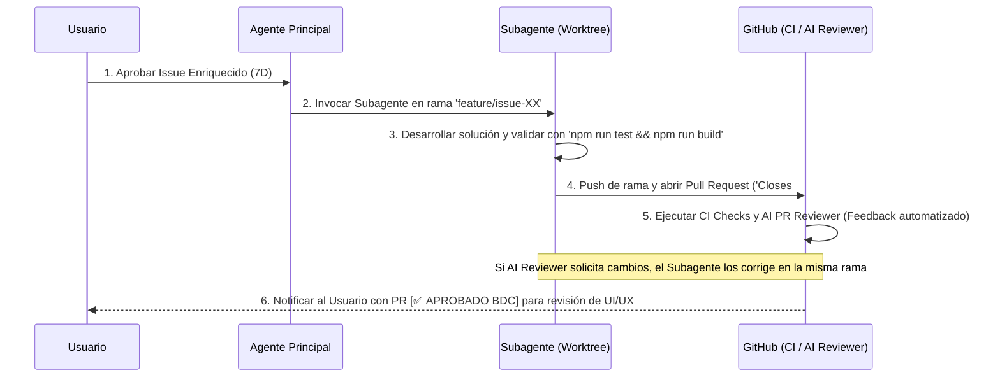

# CRM ODONTÓLOGO - Automated Issue & Review Workflow

Esta habilidad estandariza el flujo automatizado desde la creación del Issue hasta la revisión de código por IA y la entrega final al usuario.

---

## 🔄 Flujo Automatizado de 6 Pasos

---

## 📋 Protocolo de Revisión Técnica & Autocorrección

1. **Revisión Técnica 100% Automatizada:**
   - El subagente NO le pide al usuario que revise tipos de TypeScript, cobertura de código ni rendimiento. De eso se encargan los CI Checks y el **AI PR Reviewer Bot**.
2. **Ciclo de Autocorrección del Subagente:**
   - Si el AI PR Reviewer publica un comentario con observaciones o `[⚠️ REQUIERE CAMBIOS]`, el subagente lee las observaciones con `gh pr view`, aplica las correcciones en su rama `feature/issue-XX`, sube los cambios a GitHub y espera la aprobación verde del AI Reviewer (`[✅ APROBADO]`).
3. **Entrega Visual al Usuario:**
   - Una vez que el PR tiene los CI Checks en verde y la aprobación del AI PR Reviewer, el Agente Principal notifica al usuario entregando el enlace del PR. El usuario solo debe verificar el aspecto visual y la experiencia (UI/UX) antes de presionar 'Merge'.
