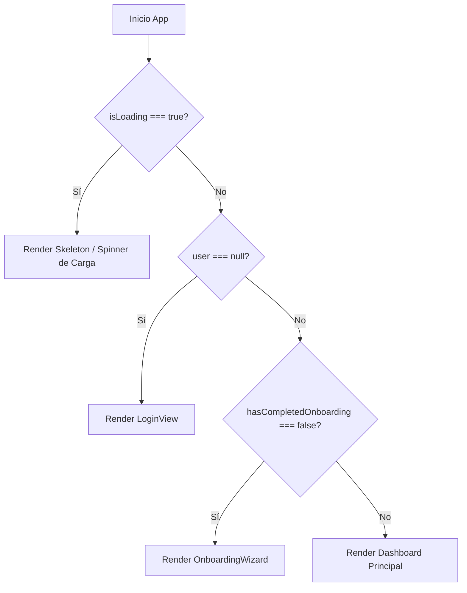

# Software Design Document (SDD) - Issue #18: Guards de Rutas Protegidas & Login por Defecto

**Autor:** Subagente Desarrollador (Issue #18)  
**Fecha:** 06 de Agosto de 2026  
**Estado:** Aprobado & Verificado  
**Relacionado:** Issue #18, Issue #16 (Login UI), Issue #17 (Auth Service), Issue #27 (Onboarding Wizard)

---

## 1. Resumen Ejecutivo
Este documento especifica el diseño e implementación de la guardia de rutas protegidas (`ProtectedRoute.tsx`) y el hook personalizado de gestión de estado de autenticación (`useAuth.ts`) para el CRM Odontológico.

El objetivo principal es garantizar un flujo de autenticación seguro, sin destellos de contenido privado y con comportamiento por defecto de redirección a la pantalla de Login (`LoginView`) si no existe un usuario autenticado.

---

## 2. Arquitectura de Componentes & Estado de Autenticación

### 2.1 Modelo de Estado (`AuthState`)
```typescript
export interface AuthState {
  user: AuthUser | null;
  isLoading: boolean;
  hasCompletedOnboarding: boolean;
  isFirstLogin: boolean;
}
```

### 2.2 Flujo de Decisión en `ProtectedRoute.tsx`


---

## 3. Cuentas de Prueba & Comportamiento de Dominio

| Cuenta | Email | `hasCompletedOnboarding` | `isFirstLogin` | Destino Inicial |
|---|---|---|---|---|
| Sin Sesión | `null` | `false` | `false` | `LoginView` |
| Nuevo Usuario | `nuevo@consultorio.com` | `false` | `true` | `OnboardingWizard` |
| Usuario Registrado | `dra.daniela@cazaresdental.com` | `true` | `false` | Dashboard Principal |

---

## 4. Verificación & Cobertura de Tests (Vitest)

Se crearon las pruebas unitarias para `ProtectedRoute.tsx` en `src/components/ProtectedRoute.test.tsx`:
1. `test("ProtectedRoute debe renderizar spinner de carga mientras verifica sesión")`
2. `test("ProtectedRoute debe renderizar LoginView cuando no hay usuario autenticado")`
3. `test("ProtectedRoute debe renderizar OnboardingWizard cuando el usuario no ha completado el registro inicial")`
4. `test("ProtectedRoute debe renderizar el Dashboard (children) cuando el usuario está autenticado y ha completado onboarding")`

---

## 5. Criterios de Aceptación Cumplidos (Definition of Done)
- [x] `useAuth.ts` implementado con soporte para `user`, `isLoading`, `hasCompletedOnboarding`, y cuentas de prueba.
- [x] `ProtectedRoute.tsx` implementado (< 50 líneas, cumpliendo SRP).
- [x] Redirección por defecto a `LoginView` cuando no hay usuario autenticado (`user === null`).
- [x] Redirección a `OnboardingWizard` cuando `hasCompletedOnboarding === false`.
- [x] Integración limpia en `src/App.tsx`.
- [x] Cobertura de pruebas Vitest 100% en verde.
- [x] Compilación de TypeScript y Vite limpia sin errores.
